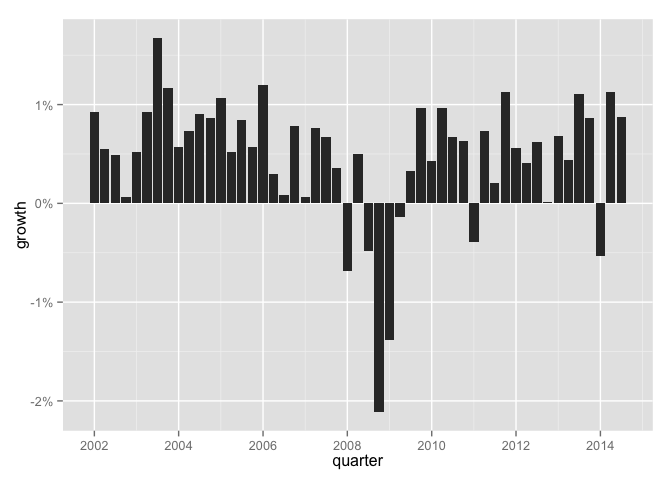
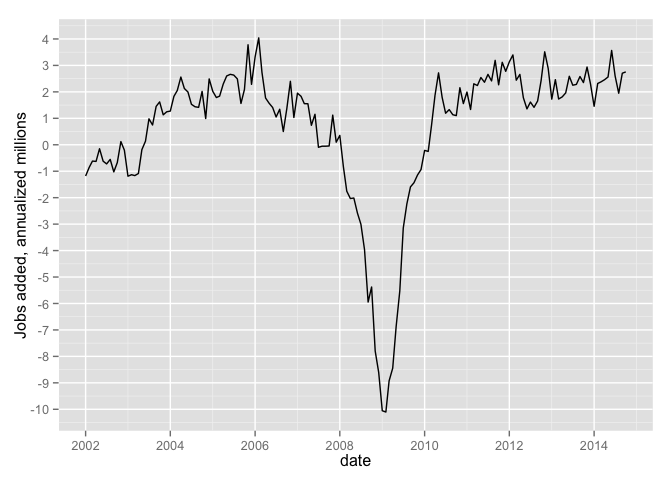
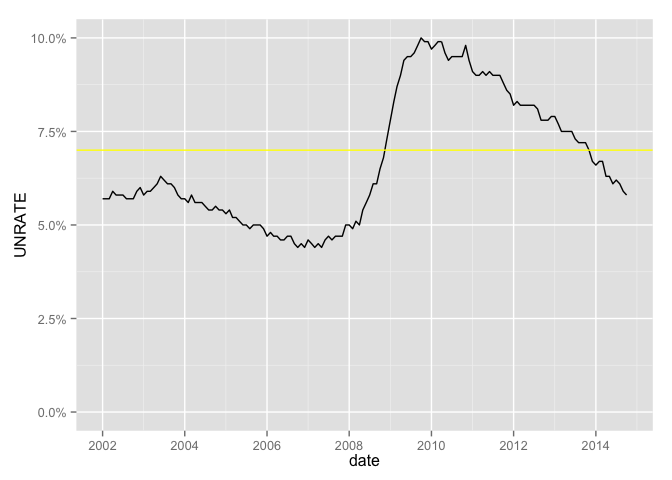
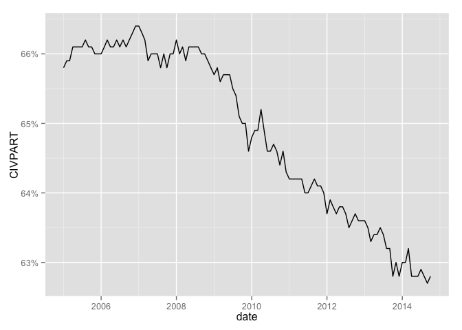
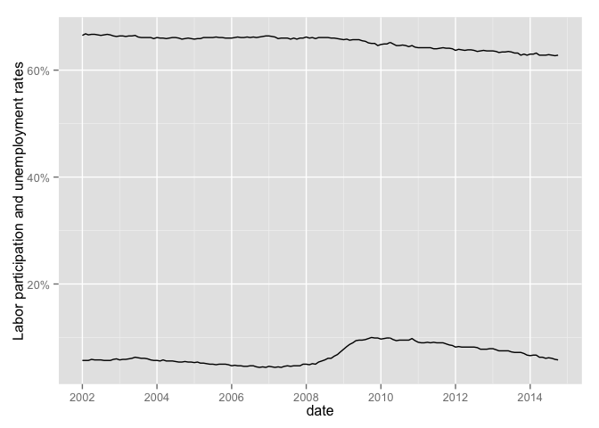
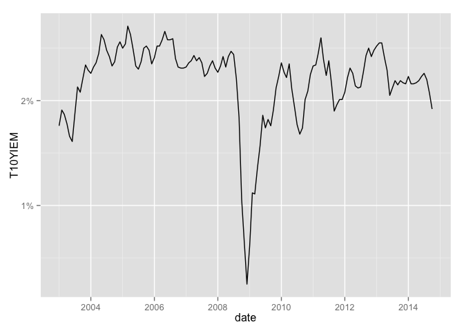
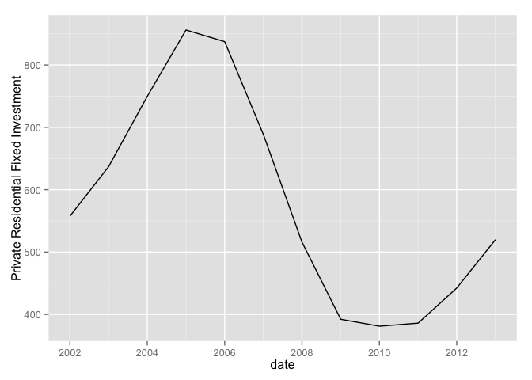
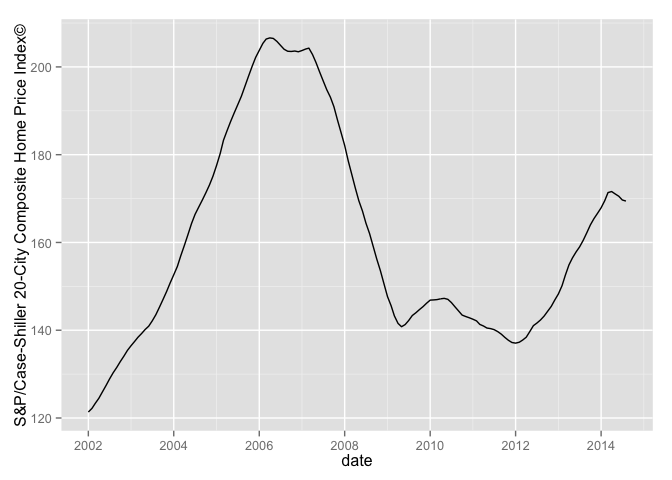
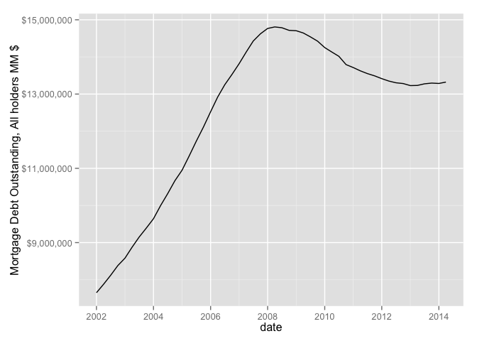
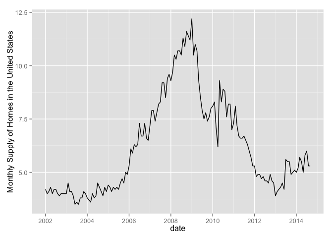

Custom FRED Data Reports
========================================================

Based on Bill McBride&rsquo;s ["Ten Economic Questions for 2014"](http://www.calculatedriskblog.com/2013/12/ten-economic-questions-for-2014.html) All the text is directly quoted from Mr. McBride.


```r
require(knitr)
```

```
## Loading required package: knitr
```

```r
require(ggplot2)
```

```
## Loading required package: ggplot2
```

```r
# require(rdatamarket)
# require(plyr)
require(lubridate)
```

```
## Loading required package: lubridate
```

```r
require(quantmod)
```

```
## Loading required package: quantmod
## Loading required package: xts
## Loading required package: zoo
## 
## Attaching package: 'zoo'
## 
## The following objects are masked from 'package:base':
## 
##     as.Date, as.Date.numeric
## 
## Loading required package: TTR
## Version 0.4-0 included new data defaults. See ?getSymbols.
```

```r
require(scales)
```

```
## Loading required package: scales
```


```r
symboldf <- function(sym){
  getSymbols(sym, src='FRED')
  df <- data.frame(get(sym))
  df$date <- ymd(row.names(df))
  df
}
```


## 1) Economic growth

Heading into 2014, it seems most analysts expect faster economic growth.  So do I.  Will 2014 be the best year of the recovery so far?  Could 2014 be the best year since the '90s?  Or will 2014 disappoint?


```r
gdp <- symboldf('GDPC1')
```

```
##     As of 0.4-0, 'getSymbols' uses env=parent.frame() and
##  auto.assign=TRUE by default.
## 
##  This  behavior  will be  phased out in 0.5-0  when the call  will
##  default to use auto.assign=FALSE. getOption("getSymbols.env") and 
##  getOptions("getSymbols.auto.assign") are now checked for alternate defaults
## 
##  This message is shown once per session and may be disabled by setting 
##  options("getSymbols.warning4.0"=FALSE). See ?getSymbol for more details
```

```r
gdp$quarter <- gdp$date
gdp$growth <- ( gdp[,'GDPC1'] - c(NA, gdp[1:nrow(gdp)-1,'GDPC1']) ) / c(NA, gdp[1:nrow(gdp)-1,'GDPC1'])

ggplot(subset(gdp, quarter >= ymd('2002-01-01') ), aes(x=quarter)) + geom_line(aes(y=growth)) +  scale_y_continuous(labels = percent)
```

 

## 2) Employment
How many payroll jobs will be added in 2013? Will we finally see some pickup over the approximately 2.1 to 2.3 million job creation rate of 2011, 2012, and 2013?


```r
payroll <- symboldf('NPPTTL')

payroll$added <- ( payroll[,'NPPTTL'] - c(NA, payroll[1:nrow(payroll)-1,'NPPTTL']) ) 
payroll$added.yr <- payroll$added * 12 / 1000

ggplot(subset(payroll, date >= ymd('2002-01-01') ), aes(x=date)) + geom_line(aes(y=added.yr)) +  scale_y_continuous("Jobs added, annualized millions", breaks=seq(-10, 5, 1))
```

 


## 3) Unemployment Rate

The unemployment rate is still elevated at 7.0% in November. For the last three years I've been too pessimistic on the unemployment rate because I was expecting some minor bounce back in the participation rate. Instead the participation rate continued to decline. Maybe 2014 will be the year the participation rate increases a little, or at least stabilizes. 


```r
unrate <- symboldf('UNRATE')
unrate$UNRATE <- unrate$UNRATE * 0.01

ggplot(subset(unrate, date >= ymd('2002-01-01') ), aes(x=date)) + geom_line(aes(y=UNRATE)) + geom_hline(yintercept=0.07, color='yellow') +  scale_y_continuous(labels = percent, limits=c(0,.1)) 
```

 

```r
civpart <- symboldf('CIVPART')
civpart$CIVPART <- civpart$CIVPART * 0.01

ggplot(subset(civpart, date >= ymd('2002-01-01') ), aes(x=date)) + geom_line(aes(y=CIVPART))  +  scale_y_continuous(labels = percent) 
```

 

```r
ggplot() + geom_line(data=subset(civpart, date >= ymd('2002-01-01')), aes(x=date, y=CIVPART))  +  
                        geom_line(data=subset(unrate, date >= ymd('2002-01-01')), aes(x=date, y=UNRATE)) +
                        scale_y_continuous("Labor participation and unemployment rates" , labels = percent) 
```

 

4) Inflation: The Fed has made it clear they will tolerate a little more inflation, but currently the inflation rate is running well below the Fed's 2% target. Will the inflation rate rise in 2014?  Will too much inflation be a concern in 2014?

_10-year Breakeven Inflation Rate:_


```r
inf <-symboldf('T10YIEM')
inf$T10YIEM <- inf$T10YIEM / 100
ggplot(subset(inf, date >= ymd('2002-01-01') ), aes(x=date)) + geom_line(aes(y=T10YIEM))  +  scale_y_continuous(labels = percent) 
```

 

5) Monetary Policy: It appears the Fed's current plan is to reduce their monthly asset purchases by about $10 billion at each FOMC meeting in 2014.  That would put the monthly purchases at close to zero in December 2014.  Will the Fed complete QE3 in 2014?   Or will the Fed continue to buy assets in 2015?

`no FRED chart for this`


6) Residential Investment: Residential investment (RI) picked was up solidly in 2012 and 2013.  Note: RI is mostly investment in new single family structures, multifamily structures, home improvement and commissions on existing home sales.  Even with the recent increases, RI is still at a historical low level. How much will RI increase in 2014?

```r
inf <-symboldf('PRFIA')
ggplot(subset(inf, date >= ymd('2002-01-01') ), aes(x=date)) + geom_line(aes(y=PRFIA))  +  scale_y_continuous('Private Residential Fixed Investment') 
```

 

7) House Prices: It appears house prices - as measured by the national repeat sales index (Case-Shiller, CoreLogic) - will be up about 12% or so in 2013.   What will happen with house prices in 2014?


```r
inf <-symboldf('SPCS20RSA')
ggplot(subset(inf, date >= ymd('2002-01-01') ), aes(x=date)) + geom_line(aes(y=SPCS20RSA))  +  scale_y_continuous('S&P/Case-Shiller 20-City Composite Home Price Index©')
```

 

8) Housing Credit: Will we see easier mortgage lending in 2014? Will we see positive mortgage equity withdrawal (MEW) after six years of negative MEW?


```r
mortgage <-symboldf('MDOAH')
ggplot(subset(mortgage, date >= ymd('2002-01-01') ), aes(x=date)) + geom_line(aes(y=MDOAH))  +  scale_y_continuous('Mortgage Debt Outstanding, All holders MM $', labels=dollar) 
```

 

9) Housing Inventory: It appears housing inventory bottomed in early 2013.  Will inventory increase in 2014, and, if so, by how much?


```r
hinv <-symboldf('MSACSR')
ggplot(subset(hinv, date >= ymd('2002-01-01') ), aes(x=date)) + geom_line(aes(y=MSACSR))  +  scale_y_continuous('Monthly Supply of Homes in the United States') 
```

 


10) Downside Risks: What are the downside risks in 2014?

