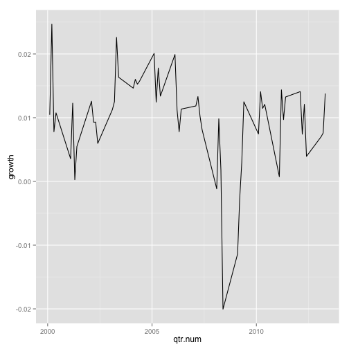
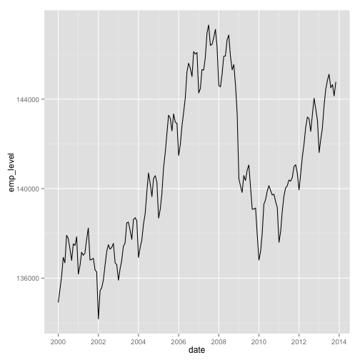
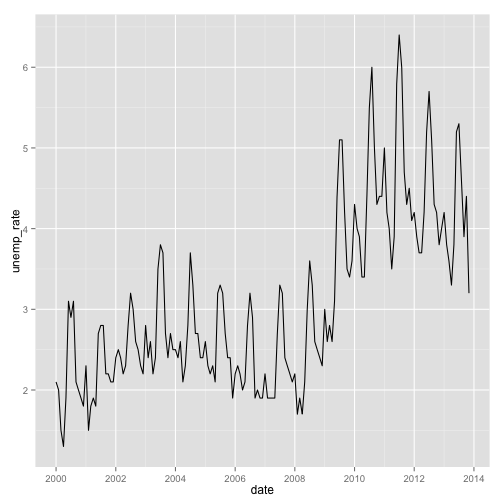

Custom FRED Data Reports
========================================================

Based on Bill McBride&rsquo;s ["Ten Economic Questions for 2014"](http://www.calculatedriskblog.com/2013/12/ten-economic-questions-for-2014.html)


```r
require(knitr)
require(ggplot2)
```

```
## Loading required package: ggplot2
```

```r
require(rdatamarket)
```

```
## Loading required package: rdatamarket Loading required package: zoo
## 
## Attaching package: 'zoo'
## 
## The following objects are masked from 'package:base':
## 
## as.Date, as.Date.numeric
```

```r
require(plyr)
```

```
## Loading required package: plyr
```

```r
require(lubridate)
```

```
## Loading required package: lubridate
## 
## Attaching package: 'lubridate'
## 
## The following object is masked from 'package:plyr':
## 
## here
```


## 1) Economic growth

Heading into 2014, it seems most analysts expect faster economic growth.  So do I.  Will 2014 be the best year of the recovery so far?  Could 2014 be the best year since the '90s?  Or will 2014 disappoint?


```r
gdp <- as.data.frame(dmseries("http://datamarket.com/data/set/3p4m/gross-domestic-product-gdp-sum-of-pieces#!ds=3p4m&display=line"))
str(gdp)
```

```
## 'data.frame':	253 obs. of  1 variable:
##  $ Gross.domestic.product..GDP...sum.of.pieces: int  227812 249945 274807 272827 300198 347294 360195 361414 368084 381241 ...
```

```r

gdp$quarter <- row.names(gdp)
names(gdp) <- c("gdp", "quarter")

gdp$growth <- (gdp[, "gdp"] - c(NA, gdp[1:nrow(gdp) - 1, "gdp"]))/c(NA, gdp[1:nrow(gdp) - 
    1, "gdp"])

gdp$qtr.num <- as.numeric(gsub(" Q", ".", gdp$quarter))

ggplot(subset(gdp, qtr.num >= 2000.1)) + geom_line(aes(x = qtr.num, y = growth))
```

 


## 2) Employment

How many payroll jobs will be added in 2013? Will we finally see some pickup over the approximately 2.1 to 2.3 million job creation rate of 2011, 2012, and 2013?

```r
emp <- as.data.frame(dmseries("http://datamarket.com/data/set/1mj6/employment-level"))

emp <- data.frame(month_year = row.names(emp), emp_level = emp[, "Employment.Level"])
emp$month <- match(gsub(" [0-9]{4}", "", emp$month_year), month.abb)

emp$year <- as.numeric(laply(strsplit(as.character(emp$month_year), " "), tail, 
    1))

emp$date <- ymd(paste(emp$year, emp$month, 1, sep = "-"))
head(emp)
```

```
##   month_year emp_level month year       date
## 1   Jan 1948     56339     1 1948 1948-01-01
## 2   Feb 1948     56440     2 1948 1948-02-01
## 3   Mar 1948     56601     3 1948 1948-03-01
## 4   Apr 1948     57471     4 1948 1948-04-01
## 5   May 1948     57763     5 1948 1948-05-01
## 6   Jun 1948     59724     6 1948 1948-06-01
```

```r

ggplot(subset(emp, year >= 2000)) + geom_line(aes(x = date, y = emp_level))
```

 


## 3) Unemployment Rate

The unemployment rate is still elevated at 7.0% in November. For the last three years I've been too pessimistic on the unemployment rate because I was expecting some minor bounce back in the participation rate. Instead the participation rate continued to decline. Maybe 2014 will be the year the participation rate increases a little, or at least stabilizes. 


```r
# unemp <- as.data.frame(dmseries('http://data.is/qb61uf'))

unemp <- as.data.frame(dmseries("http://datamarket.com/data/set/1les/unemployment-rate"))
unemp <- data.frame(month_year = row.names(unemp), unemp_rate = unemp[, "All.Industries.Government.Wage.and.Salary.Workers..Not.Seasonally.Adjusted"])

unemp <- subset(unemp, !is.na(unemp_rate))
unemp$month <- match(gsub(" [0-9]{4}", "", unemp$month_year), month.abb)

unemp$year <- as.numeric(laply(strsplit(as.character(unemp$month_year), " "), 
    tail, 1))

unemp$date <- ymd(paste(unemp$year, unemp$month, 1, sep = "-"))

ggplot(subset(unemp, year >= 2000)) + geom_line(aes(x = date, y = unemp_rate))
```

 

