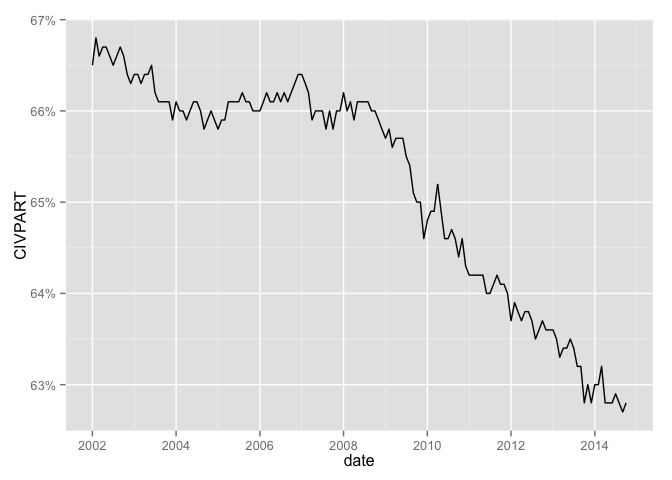

Custom FRED Data Reports
========================================================

Based on Bill McBride&rsquo;s ["Ten Economic Questions for 2014"](http://www.calculatedriskblog.com/2013/12/ten-economic-questions-for-2014.html)


```r
require(knitr)
```

```
## Loading required package: knitr
```

```r
require(ggplot2)
```

```
## Loading required package: ggplot2
```

```r
# require(rdatamarket)
# require(plyr)
require(lubridate)
```

```
## Loading required package: lubridate
```

```r
require(quantmod)
```

```
## Loading required package: quantmod
## Loading required package: xts
## Loading required package: zoo
## 
## Attaching package: 'zoo'
## 
## The following objects are masked from 'package:base':
## 
##     as.Date, as.Date.numeric
## 
## Loading required package: TTR
## Version 0.4-0 included new data defaults. See ?getSymbols.
```

```r
require(scales)
```

```
## Loading required package: scales
```


```r
symboldf <- function(sym){
  getSymbols(sym, src='FRED')
  df <- data.frame(get(sym))
  df$date <- ymd(row.names(df))
  df
}
```


## 1) Economic growth

Heading into 2014, it seems most analysts expect faster economic growth.  So do I.  Will 2014 be the best year of the recovery so far?  Could 2014 be the best year since the '90s?  Or will 2014 disappoint?


```r
gdp <- symboldf('GDPC1')
```

```
##     As of 0.4-0, 'getSymbols' uses env=parent.frame() and
##  auto.assign=TRUE by default.
## 
##  This  behavior  will be  phased out in 0.5-0  when the call  will
##  default to use auto.assign=FALSE. getOption("getSymbols.env") and 
##  getOptions("getSymbols.auto.assign") are now checked for alternate defaults
## 
##  This message is shown once per session and may be disabled by setting 
##  options("getSymbols.warning4.0"=FALSE). See ?getSymbol for more details
```

```r
gdp$quarter <- gdp$date
gdp$growth <- ( gdp[,'GDPC1'] - c(NA, gdp[1:nrow(gdp)-1,'GDPC1']) ) / c(NA, gdp[1:nrow(gdp)-1,'GDPC1'])

ggplot(subset(gdp, quarter >= ymd('2005-01-01') ), aes(x=quarter)) + geom_line(aes(y=growth)) +  scale_y_continuous(labels = percent)
```

 

## 2) Employment

How many payroll jobs will be added in 2013? Will we finally see some pickup over the approximately 2.1 to 2.3 million job creation rate of 2011, 2012, and 2013?

```r
payroll <- symboldf('NPPTTL')

payroll$added <- ( payroll[,'NPPTTL'] - c(NA, payroll[1:nrow(payroll)-1,'NPPTTL']) ) 
payroll$added.yr <- payroll$added * 12 / 1000

ggplot(subset(payroll, date >= ymd('2005-01-01') ), aes(x=date)) + geom_line(aes(y=added.yr)) +  scale_y_continuous("Jobs added, annualized millions", breaks=seq(-10, 5, 1))
```

 


## 3) Unemployment Rate

The unemployment rate is still elevated at 7.0% in November. For the last three years I've been too pessimistic on the unemployment rate because I was expecting some minor bounce back in the participation rate. Instead the participation rate continued to decline. Maybe 2014 will be the year the participation rate increases a little, or at least stabilizes. 


```r
unrate <- symboldf('UNRATE')
unrate$UNRATE <- unrate$UNRATE * 0.01

ggplot(subset(unrate, date >= ymd('2005-01-01') ), aes(x=date)) + geom_line(aes(y=UNRATE)) + geom_hline(yintercept=0.07, color='yellow') +  scale_y_continuous(labels = percent, limits=c(0,.1)) 
```

 

```r
civpart <- symboldf('CIVPART')
civpart$CIVPART <- civpart$CIVPART * 0.01

ggplot(subset(civpart, date >= ymd('2005-01-01') ), aes(x=date)) + geom_line(aes(y=CIVPART))  +  scale_y_continuous(labels = percent) 
```

 


